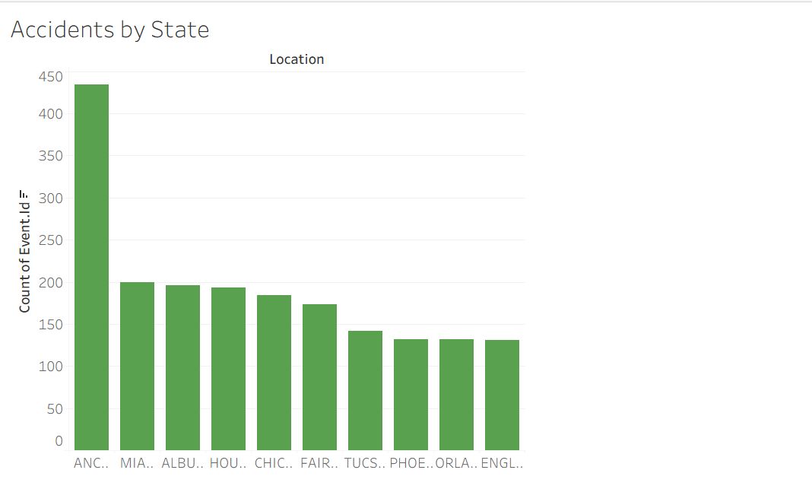

**README.md**

# Aviation Accident Risk Analysis

### Author: Brian Ndungu

---

## Overview

This project investigates U.S. aviation accident data to help a company evaluate investment risk in aircraft. Using Python and Tableau, we analyzed trends in accidents by location, aircraft type, flight purpose, and injury severity. The goal is to provide recommendations that reduce risk when entering the aviation industry.

---

## Business Understanding

**Stakeholder:** Head of the new aviation division in a company seeking to enter the aircraft investment industry.

**Business Problem:**

> The company is exploring the purchase and operation of airplanes but lacks knowledge of aviation risk. What aircraft types are safest? What locations or use-cases have the highest accident rates?

**Key Questions:**

* Which aircraft makes and models have the highest accident counts?
* What states or regions show higher accident frequency?
* Has aviation safety improved over time?
* Which types of flights (e.g., personal, business) are riskier?

---

## Data Understanding and Analysis

**Time Frame:** 1948 to 2022
**Total Records:** 90,348 → **Cleaned to:** 82,196 U.S. accidents

**Key Columns Used:**

* `Event.Date`, `Location`, `State`
* `Aircraft.Make`, `Model`, `Purpose.of.Flight`
* `Injury.Severity`, `Total.Fatal.Injuries`, `Total.Serious.Injuries`
* `Aircraft.Damage`, `Engine.Type`, `Weather.Condition`

**Data Cleaning Steps:**

* Removed non-U.S. accidents
* Filled missing injury values with 0
* Dropped rows with missing aircraft make/model
* Created `Total_Injuries` and `Year` columns

---

## Key Visualizations

### 1. **Bar Chart**: Aircraft Models With Most Accidents


- Top aircraft: Cessna, Piper, Beech
- These dominate general aviation use, explaining higher incident frequency

### 2. **Line Chart**: Aviation Accidents Per Year


- General decline in accidents over time
- Peak activity in the late 1990s, drop-off after 2010

### 3. **Pie Chart**: Fatal Accidents by Purpose of Flight


- Personal and instructional flights account for majority of fatal incidents

---

## Conclusion

This project reveals several actionable insights for safe aviation investment:

### Key Findings:

1. **Cessna** and **Piper** have the highest accident frequencies but are also the most used.
2. Accidents are most frequent in **California**, **Texas**, and **Florida** — likely due to high flight activity.
3. Most fatal accidents occur during **personal or instructional flights**.

### Business Recommendations:

* Invest in safety training and inspection in **general aviation**.
* Focus on states with high incident rates for infrastructure or regulatory improvement.
* Prefer aircraft models with lower fatality-per-incident ratios, not just low incident counts.

---

## Repository Contents

```
aviation-risk-analysis/
├── data/
│   └── Aviation_Data.csv
├── images/                  
├── notebook.ipynb
├── notebook.pdf
├── presentation.pdf
├── Aviation Accident Dashboard.pdf
├── github.pdf
├── README.md
└── .gitignore
```

---

## Run the Notebook

Ensure dependencies are installed via:

```bash
pip install pandas matplotlib seaborn
```

Then run the Jupyter Notebook:

```bash
jupyter notebook notebook.ipynb
```

---

## View Dashboard

You can view the Tableau dashboard [here](#) — upload link or embed goes here.

---

Thank you for reviewing!

**GitHub:** [github.com/Ndunguuu01/aviation-risk-analysis](https://github.com/Ndunguuu01/aviation-risk-analysis)

**Author:** Brian Ndungu

